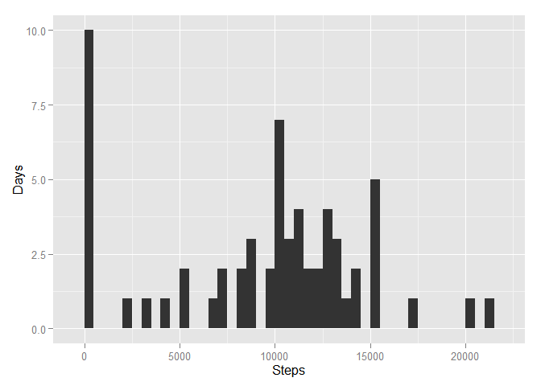
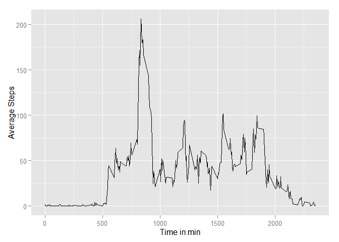
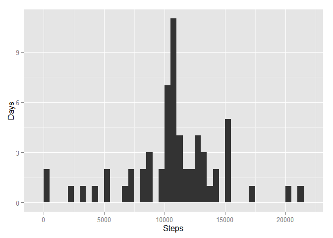
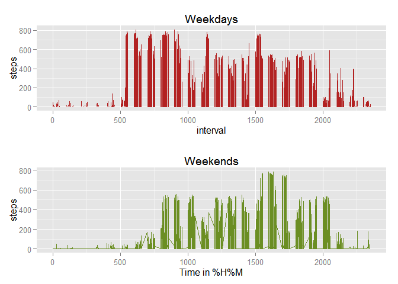

# Reproducible Research: Peer Assessment 1


## Loading and preprocessing the data
Load the data. Make sure the data is in your working directory. Sum all steps for each day.

```r
data <- read.csv("activity.csv")

data_days <- aggregate(list(steps=data$steps), by=list(day=data$date), FUN = sum, na.rm=TRUE)
```
## What is mean total number of steps taken per day?
We print a histogram plot for the number of steps in a whole day.

```r
library(ggplot2)
```

```
## Warning: package 'ggplot2' was built under R version 3.1.3
```

```r
p<-ggplot(data_days, aes(x=data_days$steps)) + geom_histogram(binwidth=500)+ xlab('Steps') + ylab('Days') 
print(p)
```

 

```r
dev.off()
```

```
## null device 
##           1
```
The median of the steps per day is

```r
median(data_days$steps)
```

```
## [1] 10395
```
The mean of the steps per day is

```r
mean(data_days$steps, rm.na=TRUE)
```

```
## [1] 9354.23
```

## What is the average daily activity pattern?
This is a plot, showing the average number of steps during one day.

```r
data_interval <- aggregate(list(steps=data$steps), by=list(interval=data$interval), FUN = mean, na.rm=TRUE)
p2 <- ggplot(data_interval, aes(x=interval, y=steps)) + geom_line()  + xlab("Time in min") + ylab("Average Steps")
print(p2)
```

 

```r
dev.off()
```

```
## null device 
##           1
```
The interval with the most average steps is

```r
data_interval[which.max(data_interval$steps), ]
```

```
##     interval    steps
## 104      835 206.1698
```
So at 8.35 am the average of 206 steps is the maximum.

## Imputing missing values
The total number of missing values (NA) is

```r
sum(is.na(data$steps))
```

```
## [1] 2304
```
We substitute the missing values (NA) with the average value for that interval and save the new data in data2.

```r
for ( i in 1:17568 ) {
    if(is.na(data[i,1])){
      data[i,1] <- data_interval[which( data_interval[,1]==data[i,3]),2]
    }
}
data2 <- data
data <- read.csv("activity.csv")
```
We create a plot now for the total step taken on each day for the dataset with the subsituted values.

```r
data_days2 <- aggregate(list(steps=data2$steps), by=list(day=data2$date), FUN = sum, na.rm=TRUE)
p3<-ggplot(data_days2, aes(x=data_days2$steps)) + geom_histogram(binwidth=500)+ xlab('Steps') + ylab('Days') 
print(p3)
```

 

```r
dev.off()
```

```
## null device 
##           1
```
The median of the steps per day is

```r
median(data_days2$steps)
```

```
## [1] 10766.19
```
The mean of the steps per day is

```r
mean(data_days2$steps)
```

```
## [1] 10766.19
```
The plot of the total number of steps is different, because the values are a sum. Obviously it gets more if we add more values to the dataset.  
For the same reason the median is bigger.  
The mean is higher as well, because we substituted missing values for the interval mean values.  
The replacement of missing values increases the average values for our dataset.  


## Are there differences in activity patterns between weekdays and weekends?
We add a new column to determine if a day is a weekday or on a weekend  

```r
data$date <- as.Date(data$date , format="%Y-%m-%d")
for(i in 1:17568){
    if((weekdays(data[i,2]) %in% c('Samstag','Sonntag'))){
      data[i,4] <- "weekend" 
    }else{
      data[i,4] <- "weekday"
    }
}
names(data)[4]<-"weekday"
subsetWD <- subset(data, weekday == "weekday")
subsetWE <- subset(data, weekday == "weekend")
```
Now we plot the average number of steps per time interval for weekdays and weekend    

```r
data_interval_wd <- aggregate(list(steps=subsetWD$steps), by=list(interval=subsetWD$interval), FUN = mean, na.rm=TRUE)
data_interval_we <- aggregate(list(steps=subsetWE$steps), by=list(interval=subsetWE$interval), FUN = mean, na.rm=TRUE)

plot1<-ggplot(subsetWD, aes(x=interval, y=steps))+geom_line(color="firebrick") + ggtitle("Weekdays")
plot2<-ggplot(subsetWE, aes(x=interval, y=steps))+geom_line(color="olivedrab") + xlab("Time in %H%M") + ggtitle("Weekends")
library(gridExtra)
```

```
## Warning: package 'gridExtra' was built under R version 3.1.3
```

```
## Loading required package: grid
```

```r
grid.arrange(plot1, plot2, nrow=2)
```

```
## Warning in loop_apply(n, do.ply): Removed 2 rows containing missing values
## (geom_path).
```

 
  
Apperently people sleep longer on the weekends ;)  


